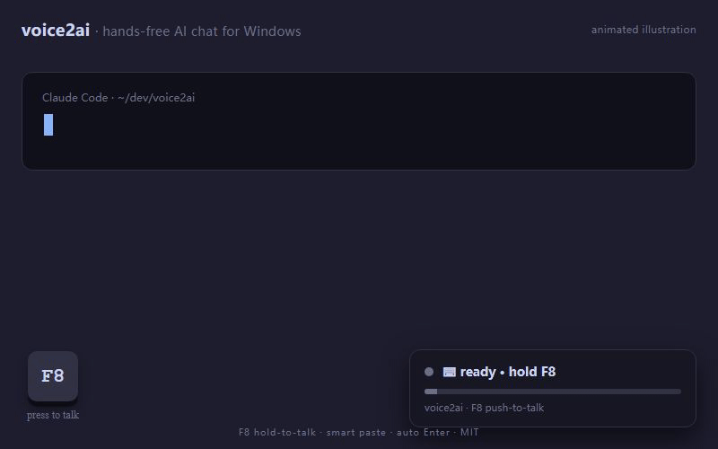

# voice2ai

Windows push-to-talk speech-to-text. Hold a hotkey, speak, release, and the
transcript is pasted into the focused app. Optional continuous mode uses voice
activity detection and can submit each utterance automatically.

[](https://www.python.org/downloads/)
[](./LICENSE)
[](#install)
[](./tests/)
[](https://github.com/lfzds4399-cpu/voice2ai/releases/latest)

[Chinese README](./README.zh-CN.md) | [Latest release](https://github.com/lfzds4399-cpu/voice2ai/releases/latest)



## What it does

| Feature | Current behavior |
|---|---|
| Push-to-talk | Default hotkey is `ctrl+shift+space`; presets include `f8`, `f9`, `right ctrl`, and `ctrl+alt+v`. |
| Continuous mode | Toggle with `f9`; EnergyVAD waits for a pause before transcribing the utterance. |
| Paste target restore | Captures the foreground window at speech start and restores it before paste. |
| Smart paste | Uses `ctrl+shift+v` for known terminal/editor targets and `ctrl+v` elsewhere. |
| STT providers | SiliconFlow, OpenAI, Groq, and Azure OpenAI Whisper-style transcription endpoints. |
| Local state | Stores configuration in `config.env` and writes a rotating `voice2ai.log`. |

The project is Windows-first because the paste backend uses Win32 keyboard APIs.
Most provider, config, audio, and VAD code is platform-neutral, but macOS and
Linux paste support are not implemented yet.

## Install

### From source

Requires Python 3.10 or newer.

```powershell
git clone https://github.com/lfzds4399-cpu/voice2ai.git
cd voice2ai
python -m pip install -r requirements.txt
python app.py
```

The first run opens a setup wizard. Choose a provider, paste the API key, test
the provider, and save.

You can also run:

```powershell
install.bat
start.bat
```

### Packaged Windows build

The project has a PyInstaller spec, but the published executable is unsigned.
Windows SmartScreen may warn on first launch.

```powershell
python -m pip install pyinstaller
build_tools\build.bat
```

The build output is `dist\voice2ai\voice2ai.exe`.

## Providers

| Provider | Default or recommended model | Notes |
|---|---|---|
| SiliconFlow | `FunAudioLLM/SenseVoiceSmall` | Good Mandarin support and mainland China access. |
| OpenAI | `whisper-1` or `gpt-4o-mini-transcribe` | Global paid API. |
| Groq | `whisper-large-v3-turbo` | Fast hosted Whisper-compatible endpoint. |
| Azure | `whisper` deployment | Requires Azure OpenAI resource configuration. |

`config.env` supports both the canonical keys and provider-specific aliases
shown in `.env.example`, including `GROQ_MODEL`, `OPENAI_MODEL`,
`SILICONFLOW_MODEL`, `AZURE_SPEECH_KEY`, and `AZURE_SPEECH_REGION`.

## How paste works

voice2ai does not type the transcript character by character. It copies the
transcript to the clipboard, releases stuck modifiers, waits briefly, restores
the target window when possible, then sends the paste shortcut.

This exists because users often hold modifier-heavy hotkeys. If `shift` is still
physically down when paste is sent, Windows may see `ctrl+shift+v` instead of
`ctrl+v`. The paste path is covered by unit tests in `tests/test_paste.py`.

## Project layout

```text
voice2ai/
  app.py                       entry-point shim
  start.bat / install.bat      Windows helpers
  pyproject.toml               package metadata and tool config
  requirements.txt             runtime dependencies
  pytest.ini                   pytest config
  config.env                   local config, gitignored
  .env.example                 config template
  src/voice2ai/
    main.py                    app orchestration
    config.py                  settings load/save and legacy aliases
    audio.py                   microphone capture and pre-roll
    hotkey.py                  global hotkey listeners
    paste.py                   clipboard and Win32 paste backend
    vad.py                     continuous-mode VAD
    diagnostics.py             dependency, mic, network, and provider checks
    providers/                 STT provider implementations
    ui/                        wizard, settings dialog, widget, tray
  tests/                       offline unit tests
  build_tools/                 PyInstaller build files
```

## Development

```powershell
python -m pip install -r requirements.txt
python -m pip install pytest ruff
python -m pytest tests/ -q
python -m compileall -q src app.py
python -m ruff check src tests app.py
```

The current test suite is offline-only. It does not call provider APIs, drive
the real keyboard, or require GUI automation.

## Privacy and security

Audio is sent only to the STT provider configured by the user. voice2ai has no
telemetry, analytics, auto-update, or network listener. API keys are stored in
local `config.env`, which is gitignored. Security reports should follow
[SECURITY.md](./SECURITY.md).

## License

MIT. See [LICENSE](./LICENSE).
